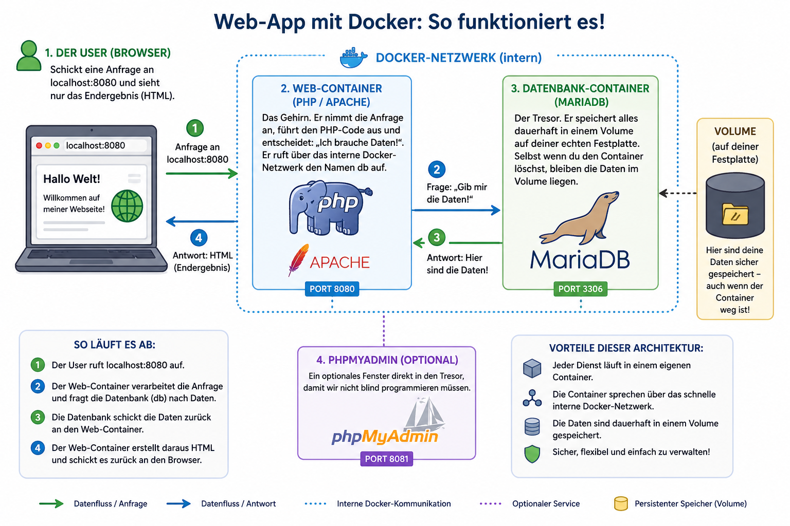

## 🐘 PHP & MariaDB Lern-Umgebung (Docker-Edition) : 🐳 Docker und 🚢 Docker Compose



### Setup für PHP

Warum machen wir das? In der modernen Softwareentwicklung geht es nicht nur darum, Code zu schreiben, sondern **Infrastrukturen zu verstehen**.

In dieser Übung lernst du:

- **Orchestrierung:** Wie man mehrere Server (Webserver + Datenbank) mit nur einem Befehl gleichzeitig startet.
- **Persistent Storage:** Wie Daten "überleben", auch wenn der Server gelöscht wird.
- **Real-time Dev:** Wie Docker-Volumes deinen Code live vom Editor in den Container spiegeln.

**Das Ziel:** Du baust heute eine einfache Website, sondern steuerst ein kleines Rechenzentrum auf deinem eigenen Laptop.

---

## 🛠 1. Vorbereitung & Start

Wir nutzen **Docker**, um eine isolierte Umgebung zu schaffen. Kein "Aber bei mir läuft das nicht!" mehr – wenn es bei mir läuft, läuft es auch bei dir.

**Deine Aufgabe:**

1.  Öffne dein Terminal im Projektordner.
2.  Starte dein Mini-Rechenzentrum:
    ```bash
    docker compose up -d --build
    ```
    
Nur wenn du den **Dockerfile** änderst, denn Docker das Image neu bauen muss.

**Zum Beispiel:**

- neue PHP Extension installieren
- Apache Konfiguration ändern
- Composer im Image installieren
- Systempakete hinzufügen
  
    
3.  Prüfe deine "Infrastruktur":
    - **Frontend (PHP):** [http://localhost:8080](http://localhost:8080)
    - **Database Management (phpMyAdmin):** [http://localhost:8081](http://localhost:8081)

---

## 🔍 2. Der Datenbank-Check: Blick in die Maschine

Programmierung ist Kommunikation. Dein PHP-Script "redet" mit der MariaDB-Datenbank. Lass uns dieses Gespräch belauschen.

**Aufgabe:**

1.  Logge dich bei [phpMyAdmin](http://localhost:8081) ein:
    - **User:** `root` | **Passwort:** `root_password`
2.  Wähle die Datenbank `studis_db` und klicke auf die Tabelle `lern_fortschritt`.
3.  **Die Challenge:** Erstelle manuell einen Datensatz über den Reiter **"Einfügen"**.
4.  Lade `localhost:8080` neu. Siehst du, wie PHP deine manuell eingefügten Daten sofort erkennt? Das ist die Kraft einer dynamischen Webanwendung.

---

## 💻 3. Code-Anpassung: Hands-on (JS vs. PHP)

Du kommst aus der JavaScript/TS-Welt? Dann wird dir auffallen: PHP ist wie "JavaScript auf dem Server", aber mit Dollarzeichen `$`.

Öffne `src/index.php` und experimentiere:


---

## 🛑 4. Feierabend: Das System sicher herunterfahren

Einer der größten Vorteile von Docker: Sauberkeit. Wenn du fertig bist, hinterlässt du keine installierten Dienste auf deinem System.

```bash
docker compose down
```

> **Pro-Tipp für Studis:** Obwohl die Container (die "Maschinen") gelöscht werden, bleiben deine Daten im sogenannten **Volume** sicher gespeichert. Starte morgen neu und alles ist noch da. Das ist echte Persistenz!

---
## 5. Wann brauchst du `docker compose restart`?
**Zum Beispiel wenn:**

- Environment Variables geändert wurden
- Apache neu geladen werden soll
- Services hängen geblieben sind

Dann:

```bash 
docker compose restart
```

### Datenbank bleibt erhalten?

#### Ja 

Weil du das hast:

```yaml
volumes:
  - db_data:/var/lib/mysql
```

Das bedeutet:

Deine MariaDB Daten bleiben gespeichert, auch wenn Container gestoppt werden.

---
## Typischer Arbeitsablauf

### Morgens starten

```bash 
docker compose up -d
```

→ Container laufen im Hintergrund
→ Terminal bleibt frei

---

### Dann entwickeln

```text 
VS Code öffnen
PHP schreiben
Browser testen
phpMyAdmin prüfen
```

---

### Abends stoppen

```bash id="rt7b1q"
docker compose down
```

---


### 😎 Viel Spaß 👩🏻‍💻
